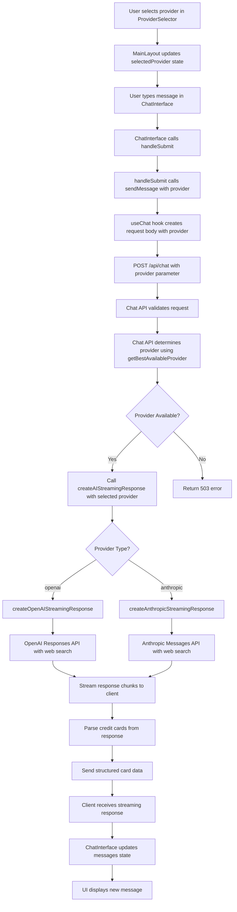

# API Documentation

## API Folder Structure

```
src/app/api/
├── chat/
│   └── route.js          # Main chat endpoint - handles AI conversations
├── search/
│   └── route.js          # Search endpoint (if used)
└── utils/
    ├── anthropic.js      # Anthropic AI service utilities
    ├── openai.js         # OpenAI AI service utilities
    ├── providers.js      # Provider management utilities
    └── validation.js     # Request validation utilities
```

## API Endpoints

### 1. Chat API (`/api/chat`)

**File**: `src/app/api/chat/route.js`

**Method**: `POST`

**Purpose**: Handles AI chat conversations with provider selection and fallback support.

**Request Body**:
```json
{
  "message": "string",           // User's message
  "preferences": "object",       // User preferences (optional)
  "provider": "string"           // AI provider: 'openai' or 'anthropic' (optional)
}
```

**Response**: Server-Sent Events (SSE) stream
```
Content-Type: text/event-stream
X-AI-Provider: openai|anthropic

data: {"content": "chunk of response text"}
data: {"type": "cards", "cards": [...]}
data: [DONE]
```

**Features**:
- Provider selection with automatic fallback
- Streaming responses
- Credit card parsing and enhancement
- Rate limiting
- Error handling with retry logic

### 2. Search API (`/api/search`)

**File**: `src/app/api/search/route.js`

**Method**: `GET`

**Purpose**: Handles search functionality (if implemented).

## Utility Files

### 1. OpenAI Utilities (`utils/openai.js`)

**Purpose**: Handles all OpenAI API interactions using the Responses API.

**Key Functions**:
- `createOpenAIResponse(userMessage, userPreferences)` - Creates OpenAI response with web search
- `createOpenAIStreamingResponse(userMessage, userPreferences)` - Creates streaming response
- `getOpenAIProviderInfo()` - Returns OpenAI availability info
- `isOpenAIAvailable()` - Checks if OpenAI is configured

**Features**:
- Uses OpenAI Responses API with web search tool
- Model: `gpt-4.1`
- Search context size: `medium`
- Streaming response conversion
- Credit card parsing from responses

### 2. Anthropic Utilities (`utils/anthropic.js`)

**Purpose**: Handles all Anthropic API interactions using Claude models.

**Key Functions**:
- `createAnthropicResponse(userMessage, userPreferences)` - Creates Anthropic response
- `createAnthropicStreamingResponse(userMessage, userPreferences)` - Creates streaming response
- `getAnthropicProviderInfo()` - Returns Anthropic availability info
- `isAnthropicAvailable()` - Checks if Anthropic is configured

**Features**:
- Uses Claude-3.5-Sonnet model
- Web search tool integration
- Streaming response conversion
- Credit card parsing from responses

**Web Search Tool Configuration**:
```javascript
export const webSearchTool = {
  type: "web_search_20250305",
  name: "web_search",
  max_uses: 10,
  allowed_domains: [
    "nerdwallet.com", "creditkarma.com", "bankrate.com",
    "chase.com", "amex.com", "discover.com", "capitalone.com",
    "citi.com", "wellsfargo.com", "usbank.com",
    "creditcards.com", "wallethub.com", "thepointsguy.com"
  ]
}
```

### 3. Provider Management (`utils/providers.js`)

**Purpose**: Manages AI provider information and selection logic.

**Key Functions**:
- `getProviderInfo()` - Returns comprehensive provider information
- `isProviderAvailable(provider)` - Checks if a specific provider is available
- `getBestAvailableProvider(requestedProvider)` - Selects best available provider with fallback

**Provider Information Structure**:
```javascript
{
  currentProvider: "openai|anthropic",
  availableProviders: ["openai", "anthropic"],
  hasOpenAI: boolean,
  hasAnthropic: boolean,
  openAI: { hasOpenAI: boolean, isAvailable: boolean },
  anthropic: { hasAnthropic: boolean, isAvailable: boolean }
}
```

### 4. Validation (`utils/validation.js`)

**Purpose**: Validates incoming requests and handles rate limiting.

**Key Functions**:
- `validateChatRequest(body)` - Validates chat request structure
- `chatRateLimiter` - Rate limiting implementation

## API Call Flow

### Complete Flow: Component → API → Response



### Detailed Component Flow

#### 1. Provider Selection
```javascript
// MainLayout.js
const [selectedProvider, setSelectedProvider] = useState('openai');

// ProviderSelector.js
const handleProviderChange = (provider) => {
  onProviderChange?.(provider); // Calls MainLayout's handleProviderChange
};
```

#### 2. Message Sending
```javascript
// ChatInterface.tsx
const handleSubmit = async (event?, options?) => {
  const preferences = getPreferencesForAPI();
  await sendMessage(input, preferences, selectedProvider);
};
```

#### 3. HTTP Request
```javascript
// useChat.ts
const sendMessage = useCallback(async (message, preferences = {}, provider = null) => {
  const requestBody = {
    message,
    preferences
  };

  // Only include provider if it's explicitly set
  if (provider) {
    requestBody.provider = provider;
  }

  const response = await fetch('/api/chat', {
    method: 'POST',
    headers: { 'Content-Type': 'application/json' },
    body: JSON.stringify(requestBody),
  });
});
```

#### 4. API Processing
```javascript
// route.js
export async function POST(request) {
  const { message, preferences, provider } = validateChatRequest(body);
  
  // Get best available provider
  const usedProvider = getBestAvailableProvider(provider);
  
  // Create streaming response
  const response = await createAIStreamingResponse(message, preferences, usedProvider);
  
  return new Response(response, {
    headers: {
      'Content-Type': 'text/event-stream',
      'X-AI-Provider': usedProvider,
    },
  });
}
```

#### 5. Provider-Specific Processing
```javascript
// For OpenAI
const createOpenAIStreamingResponse = async (userMessage, userPreferences) => {
  const response = await openai.responses.create({
    model: "gpt-4.1",
    tools: [{ type: "web_search_preview", search_context_size: "medium" }],
    input: `${systemPrompt}\n\nUser request: ${userMessage}`,
  });
  
  // Convert to streaming format and parse credit cards
};

// For Anthropic
const createAnthropicStreamingResponse = async (userMessage, userPreferences) => {
  const response = await anthropic.messages.create({
    model: "claude-3-5-sonnet-20241022",
    max_tokens: 4000,
    system: systemPrompt,
    tools: [webSearchTool],
    messages: [{ role: "user", content: userMessage }]
  });
  
  // Convert to streaming format and parse credit cards
};
```

### Error Handling and Fallbacks

1. **Provider Unavailable**: If requested provider is not available, API returns 503 error
2. **Provider Overload**: If primary provider is overloaded, API attempts fallback to secondary provider
3. **Both Providers Fail**: If both providers fail, API returns 503 with appropriate error message
4. **Rate Limiting**: Requests are rate-limited per IP address
5. **Validation Errors**: Invalid requests return 400 with error details

### Environment Variables

```bash
# OpenAI Configuration
OPENAI_API_KEY=your_openai_api_key

# Anthropic Configuration  
ANTHROPIC_API_KEY=your_anthropic_api_key

# Optional: Default provider (defaults to 'anthropic')
AI_PROVIDER=openai|anthropic
```

### Response Format

The API returns Server-Sent Events (SSE) with the following event types:

1. **Content Chunks**: `{"content": "text chunk"}`
2. **Card Data**: `{"type": "cards", "cards": [...]}`
3. **End Signal**: `[DONE]`
4. **Errors**: `{"error": "error message"}`

This architecture ensures clean separation of concerns, proper error handling, and seamless provider switching while maintaining a consistent user experience.