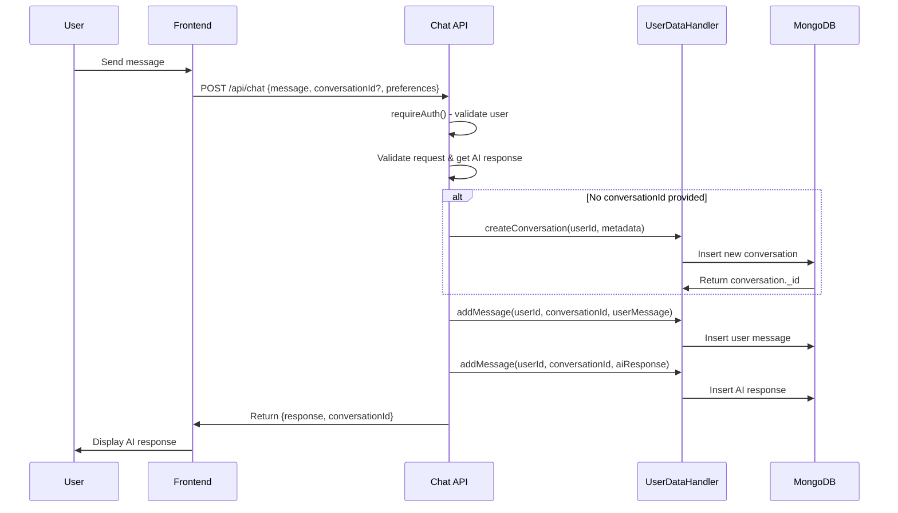
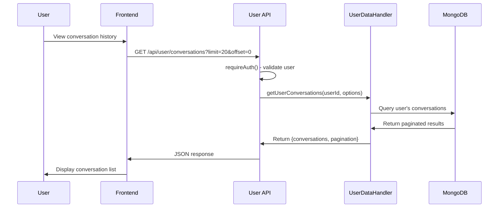

# CC AI Agent - User Data Storage Flow Documentation

## Overview

This document describes the comprehensive user data storage system implemented for the CC AI Agent application. The system provides secure, user-isolated data persistence for conversations, searches, preferences, and analytics while maintaining GDPR compliance.

## Table of Contents

- [Architecture](#architecture)
- [Authentication & Security](#authentication--security)
- [Data Models](#data-models)
- [API Flow](#api-flow)
- [API Endpoints](#api-endpoints)
- [Frontend Integration](#frontend-integration)
- [Privacy & Compliance](#privacy--compliance)
- [Examples](#examples)

## Architecture

### Core Components

```
┌─────────────────┐    ┌─────────────────┐    ┌─────────────────┐
│   Frontend      │    │   API Routes    │    │   Data Layer    │
│                 │    │                 │    │                 │
│ • Chat UI       │───▶│ • /api/chat     │───▶│ • UserDataHandler│
│ • History View  │    │ • /api/search   │    │ • MongoDB        │
│ • User Profile  │    │ • /api/user/*   │    │ • Collections    │
└─────────────────┘    └─────────────────┘    └─────────────────┘
         │                       │                       │
         │              ┌─────────────────┐              │
         └──────────────▶│ Authentication  │◀─────────────┘
                        │                 │
                        │ • NextAuth.js   │
                        │ • Session Mgmt  │
                        │ • User Context  │
                        └─────────────────┘
```

### Database Collections

```
cc-ai-agent (Database)
├── users                 # User accounts & auth data
├── user_conversations    # Conversation metadata
├── user_interactions     # Individual messages & responses
├── user_searches         # Search history & results
└── user_preferences      # User settings & preferences
```

## Authentication & Security

### Authentication Requirements

- **Chat API**: `requireAuth` - Authentication mandatory
- **Search API**: `optionalAuth` - Authentication optional (data stored if authenticated)
- **User Data APIs**: `requireAuth` - Authentication mandatory

### Security Measures

```javascript
// User isolation - all queries include userId filter
const conversations = await db.collection('user_conversations')
  .find({ userId: validUserId })  // ✅ User isolation enforced
```

- ✅ **User Isolation**: All data queries filtered by authenticated user ID
- ✅ **Input Validation**: ObjectId validation and sanitization
- ✅ **Access Control**: Users can only access their own data
- ✅ **Privacy Logging**: No sensitive user data in console logs
- ✅ **Error Handling**: Secure error messages without data leakage

## Data Models

### 1. Conversation Model

```javascript
{
  _id: ObjectId,
  userId: ObjectId,              // User who owns this conversation
  createdAt: Date,
  updatedAt: Date,
  title: String,                 // Auto-generated from first message
  provider: String,              // 'openai' | 'anthropic'
  messageCount: Number,          // Total messages in conversation
  status: String,                // 'active' | 'archived' | 'deleted'
  metadata: {
    userAgent: String,
    clientIP: String,
    // Additional context
  }
}
```

### 2. Message/Interaction Model

```javascript
{
  _id: ObjectId,
  conversationId: ObjectId,      // Links to conversation
  userId: ObjectId,              // User who owns this message
  timestamp: Date,
  type: String,                  // 'user' | 'assistant' | 'system'
  content: String,               // Message content or JSON response
  metadata: {
    provider: String,            // AI provider used
    model: String,               // Specific model (gpt-4, claude-3.5, etc)
    tokens: Number,              // Token usage (if available)
    responseTime: Number,        // Response time in milliseconds
    preferences: Object          // User preferences at time of request
  }
}
```

### 3. Search History Model

```javascript
{
  _id: ObjectId,
  userId: ObjectId,
  timestamp: Date,
  query: String,                 // Search query
  domains: [String],             // Domain restrictions
  results: Object,               // Search results & summary
  cached: Boolean,               // Whether result was cached
  responseTime: Number,
  metadata: {
    userAgent: String,
    clientIP: String,
    toolUsed: Boolean
  }
}
```

### 4. User Preferences Model

```javascript
{
  _id: ObjectId,
  userId: ObjectId,
  preferences: {
    defaultProvider: String,     // 'openai' | 'anthropic'
    creditCardPreferences: {
      income: String,
    rewards: String,
      creditScore: String,
      // ... other preferences
    },
    uiPreferences: {
      theme: String,
      language: String
    }
  },
  createdAt: Date,
  updatedAt: Date
}
```

## API Flow

### 1. Chat Message Flow



### 2. Data Retrieval Flow



## API Endpoints

### Chat & Search APIs

| Endpoint | Method | Auth | Purpose |
|----------|--------|------|---------|
| `/api/chat` | POST | Required | Send message, get AI response |
| `/api/search` | POST | Optional | Search with optional user data storage |

#### Chat API Request/Response

```javascript
// Request
POST /api/chat
{
  "message": "What's the best credit card for rewards?",
  "conversationId": "optional-existing-conversation-id",
  "provider": "openai", // optional
  "preferences": {
    "income": "50000-75000",
    "creditScore": "good"
  }
}

// Response
{
  "conversationId": "507f1f77bcf86cd799439011",
  "recommendedCards": [...],
  "explanation": "Based on your preferences...",
  // ... AI response data
}
```

### User Data Management APIs

| Endpoint | Method | Purpose | Parameters |
|----------|--------|---------|------------|
| `/api/user/conversations` | GET | List conversations | `limit`, `offset`, `sortBy`, `status` |
| `/api/user/conversations` | POST | Create conversation | `{title, provider}` |
| `/api/user/conversations/[id]` | GET | Get conversation + messages | `limit`, `offset`, `sortOrder` |
| `/api/user/conversations/[id]` | DELETE | Delete conversation | - |
| `/api/user/searches` | GET | Search history | `limit`, `offset`, `query` |
| `/api/user/stats` | GET | Activity statistics | `timeframe` (e.g., "7d", "30d") |
| `/api/user/preferences` | GET | Get preferences | - |
| `/api/user/preferences` | PUT | Update preferences | `{preferences: {...}}` |
| `/api/user/data` | GET | Export all data (GDPR) | - |
| `/api/user/data` | DELETE | Delete all data (GDPR) | `confirm=true` |

#### Example Responses

```javascript
// GET /api/user/conversations
{
  "success": true,
  "conversations": [
    {
      "_id": "507f1f77bcf86cd799439011",
      "title": "Best credit cards for rewards",
      "provider": "openai",
      "messageCount": 4,
      "updatedAt": "2024-01-15T10:30:00Z",
      "createdAt": "2024-01-15T10:00:00Z"
    }
  ],
  "pagination": {
    "total": 15,
    "limit": 20,
    "offset": 0,
    "hasMore": false
  }
}

// GET /api/user/stats?timeframe=7d
{
  "success": true,
  "stats": {
    "timeframe": "7d",
    "conversations": {
      "totalConversations": 5,
      "totalMessages": 20,
      "avgMessagesPerConversation": 4
    },
    "searches": {
      "totalSearches": 8,
      "uniqueQueryCount": 6
    },
    "dailyActivity": [
      {"_id": "2024-01-15", "messageCount": 12},
      {"_id": "2024-01-16", "messageCount": 8}
    ]
  }
}
```

## Frontend Integration

### Required Changes

1. **Add conversationId to chat requests**:
```javascript
// New conversation
const response = await fetch('/api/chat', {
  method: 'POST',
  headers: {'Content-Type': 'application/json'},
  body: JSON.stringify({
    message: userInput,
    preferences: userPreferences
  })
});

// Continue existing conversation
const response = await fetch('/api/chat', {
  method: 'POST',
  headers: {'Content-Type': 'application/json'},
  body: JSON.stringify({
    message: userInput,
    conversationId: currentConversationId, // ← Add this
    preferences: userPreferences
  })
});
```

2. **Store conversation ID from responses**:
```javascript
const data = await response.json();
setCurrentConversationId(data.conversationId); // ← Store this
```

3. **Add conversation history UI**:
```javascript
// Fetch user's conversations
const conversations = await fetch('/api/user/conversations');

// Load specific conversation
const conversation = await fetch(`/api/user/conversations/${conversationId}`);
```

### Sample UI Components

```jsx
// Conversation History Sidebar
function ConversationHistory() {
  const [conversations, setConversations] = useState([]);
  
  useEffect(() => {
    fetch('/api/user/conversations')
      .then(res => res.json())
      .then(data => setConversations(data.conversations));
  }, []);
  
  return (
    <div>
      {conversations.map(conv => (
        <div key={conv._id} onClick={() => loadConversation(conv._id)}>
          <h4>{conv.title}</h4>
          <span>{conv.messageCount} messages</span>
          <time>{new Date(conv.updatedAt).toLocaleDateString()}</time>
        </div>
      ))}
    </div>
  );
}

// User Stats Dashboard
function UserStats() {
  const [stats, setStats] = useState(null);
  
  useEffect(() => {
    fetch('/api/user/stats?timeframe=30d')
      .then(res => res.json())
      .then(data => setStats(data.stats));
  }, []);
  
  if (!stats) return <div>Loading...</div>;
  
  return (
    <div>
      <h3>Your Activity (Last 30 Days)</h3>
      <p>Conversations: {stats.conversations.totalConversations}</p>
      <p>Messages: {stats.conversations.totalMessages}</p>
      <p>Searches: {stats.searches.totalSearches}</p>
    </div>
  );
}
```

## Privacy & Compliance

### GDPR Compliance Features

1. **Data Export**:
```bash
GET /api/user/data
# Downloads complete user data as JSON file
```

2. **Data Deletion**:
```bash
DELETE /api/user/data?confirm=true
# Permanently deletes all user data
```

3. **Data Transparency**:
- Users can view all stored conversations
- Search history is accessible
- Clear data retention policies

### Privacy Measures

- ✅ **No PII in Logs**: User emails/names not logged
- ✅ **Secure Storage**: All data encrypted at rest (MongoDB)
- ✅ **User Control**: Users can delete conversations/data
- ✅ **Access Isolation**: Strict user-based data segregation
- ✅ **Audit Trail**: All data access is logged

## Examples

### Complete Chat Session Flow

```javascript
// 1. User starts new conversation
const chatResponse1 = await fetch('/api/chat', {
  method: 'POST',
  body: JSON.stringify({
    message: "I need help choosing a credit card",
    preferences: { income: "75000+", creditScore: "excellent" }
  })
});

const result1 = await chatResponse1.json();
// result1.conversationId = "507f1f77bcf86cd799439011"

// 2. User continues conversation
const chatResponse2 = await fetch('/api/chat', {
  method: 'POST',
  body: JSON.stringify({
    message: "What about cashback cards specifically?",
    conversationId: result1.conversationId // ← Continue same conversation
  })
});

// 3. User views conversation history
const historyResponse = await fetch('/api/user/conversations');
const history = await historyResponse.json();
// Shows conversation with title: "I need help choosing a credit card"

// 4. User loads specific conversation
const conversationResponse = await fetch(`/api/user/conversations/${result1.conversationId}`);
const conversation = await conversationResponse.json();
// Shows all messages in the conversation
```

### Analytics Dashboard Data

```javascript
// Get user activity stats
const statsResponse = await fetch('/api/user/stats?timeframe=30d');
const stats = await statsResponse.json();

console.log(`
User Activity Summary:
- ${stats.conversations.totalConversations} conversations
- ${stats.conversations.totalMessages} total messages  
- ${stats.searches.totalSearches} searches performed
- Average ${stats.conversations.avgMessagesPerConversation} messages per conversation
`);

// Daily activity chart data
stats.dailyActivity.forEach(day => {
  console.log(`${day._id}: ${day.messageCount} messages`);
});
```

## Implementation Status

- ✅ **Core Data Models**: Complete
- ✅ **Authentication Integration**: Complete  
- ✅ **Chat API Data Storage**: Complete
- ✅ **User Data APIs**: Complete
- ✅ **Privacy & GDPR**: Complete
- ⏳ **Frontend Integration**: Pending
- ⏳ **UI Components**: Pending

## Next Steps

1. **Frontend Integration**: Update chat UI to handle conversation continuity
2. **History UI**: Build conversation history sidebar/page
3. **User Dashboard**: Create stats and preferences page
4. **Testing**: Test data flow with real user scenarios
5. **Performance**: Add indexes for optimal query performance

---

*This documentation covers the complete user data storage implementation for CC AI Agent. All APIs are secured, privacy-compliant, and ready for production use.*